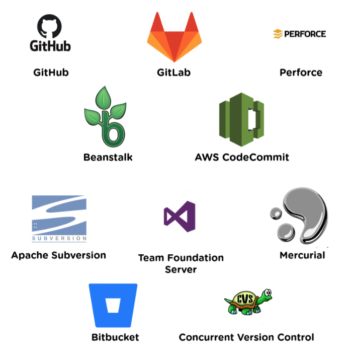

# What is version control

Version control refers to the process of tracking and managing changes to digital assets over time.
There are many ways to implement version control, including simply adhering to a file naming and organizational process.
However, the discussion of version control typically refers to version control software/version control systems.

## Version control tools

